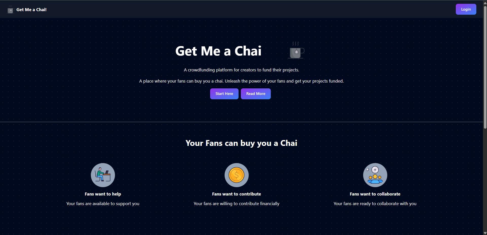

# ☕ Get Me A Chai – Patreon Clone with Next.js & MongoDB



**Get Me A Chai** is a modern crowdfunding platform inspired by Patreon, enabling creators to receive support from their audience through one-time or recurring donations. Built with **Next.js**, **MongoDB**, and **Razorpay**, it offers a seamless experience for both creators and supporters.

---

## 🚀 Features

- 🔐 Secure user authentication via GitHub and Google (NextAuth.js)
- 👤 Creator profiles with personalized pages
- 💳 Payment integration using Razorpay
- 📄 Dynamic routing for creator pages
- 📊 Dashboard to track earnings and supporters
- 🎨 Responsive UI with Tailwind CSS

---

## 🛠 Tech Stack

| Technology   | Description                          |
|--------------|--------------------------------------|
| Next.js      | React framework for SSR & APIs       |
| MongoDB      | NoSQL database for data storage      |
| NextAuth.js  | Authentication via OAuth providers   |
| Razorpay     | Payment gateway integration          |
| Tailwind CSS | Utility-first CSS framework          |

---


---

## ⚙️ Getting Started

### Prerequisites

- Node.js and npm installed
- MongoDB database
- Razorpay account for payment integration

### Installation

## 1. Clone the repository
```
git clone https://github.com/mr-coder-raj/Get-me-a-chai_NextJS-MongoDB.git
```

## 2. Navigate to the project directory
```
cd Get-me-a-chai_NextJS-MongoDB
```

## 3. Install dependencies
```
npm install
```

## 4. Set up environment variables
### Create a `.env.local` file in the root directory and add the following:

```
MONGODB_URI=your_mongodb_connection_string
NEXTAUTH_URL=http://localhost:3000
NEXTAUTH_SECRET=your_nextauth_secret
GITHUB_ID=your_github_client_id
GITHUB_SECRET=your_github_client_secret
GOOGLE_CLIENT_ID=your_google_client_id
GOOGLE_CLIENT_SECRET=your_google_client_secret
RAZORPAY_KEY_ID=your_razorpay_key_id
RAZORPAY_KEY_SECRET=your_razorpay_key_secret
```

## 5. Start the development server
```
npm run dev
```
### Open your browser and visit:
👉 http://localhost:3000

## 📈 Future Enhancements
- Email notifications for supporters and creators

- Support for multiple payment gateways

- Creator tiers and subscription plans

- Admin panel for platform management

## 🤝 Contributing
Contributions are welcome! If you have suggestions or improvements, feel free to fork this repo and submit a pull request. For major changes, please open an issue first to discuss what you would like to change.

## 📄 License
This project is licensed under the MIT License.

> Made with ❤️ by @mr-coder-raj
